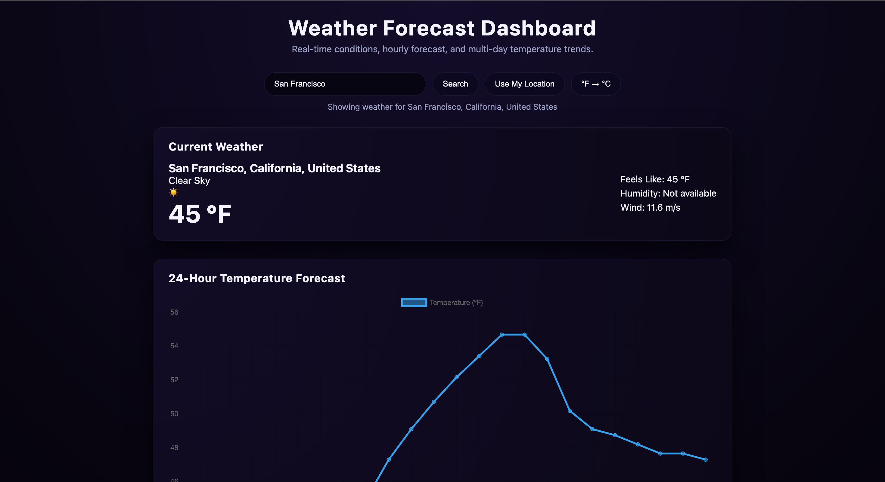
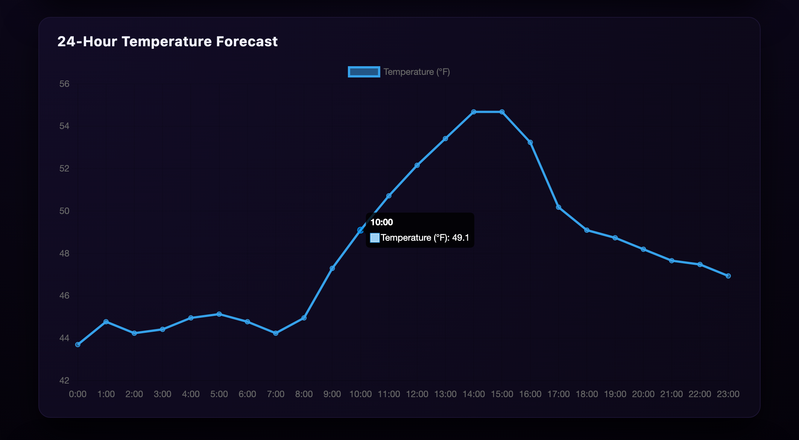

# Weather Forecast Dashboard

**Author:** Jos Thomas  
**Project Type:** Personal Front-End Practice Project  
**Technologies:** HTML, CSS, JavaScript, Chart.js (CDN), Open-Meteo API, Browser Geolocation API

---

## Project Overview
This project is a fully front-end weather forecasting dashboard that allows users to search for any city and view real-time weather conditions, a 24-hour temperature forecast, and multi-day temperature trends. Users can also enable location access to retrieve local weather data instantly and toggle between Fahrenheit and Celsius.
I built this application to strengthen my skills in working with external APIs, handling real user input, visualizing dynamic data with charts, and organizing a complete front-end project using only vanilla JavaScript, HTML, and CSS. The entire app runs fully in the browser and requires no backend setup or API keys.

---

## Features

- Search weather by city name  
- Use current GPS location  
- Toggle between Fahrenheit and Celsius  
- 24-hour temperature forecast using a line chart  
- Multi-day minimum and maximum temperature trends using a bar chart  
- Live weather condition icons  
- Custom dark-themed user interface  

---

## Technologies Used

- HTML5 for page structure  
- CSS3 for layout and theming  
- Vanilla JavaScript for application logic  
- Chart.js for data visualization  
- Open-Meteo API for free live weather data
- Browser Geolocation API for location-based weather lookup  

---

## How to Run the Project

This project runs entirely in the browser.

### Option 1: Using VS Code and Live Server (recommended)
1. Open the project folder in VS Code  
2. Install the Live Server extension  
3. Right-click on `index.html` and select "Open with Live Server"  

### Option 2: Open Directly in a Browser
1. Double-click `index.html`  
2. The application will run locally in your default browser  

---

## What I Learned From This Project

Through this project, I learned how to:
- Work with real API data and handle asynchronous requests
- Convert and format real-world data for users
- Build interactive charts using JavaScript
- Manage basic application state like unit toggling and last search
- Debug real layout and rendering issues
- Design and organize a clean, dark-themed interface

---

## Future Improvements

Some improvements I would like to add in the future include:
- Saving favorite cities using localStorage  
- Automatically loading the last searched city  
- Adding precipitation and humidity charts  
- Adding better accessibility support  

---

## Screenshots (Desktop and Mobile)

### Desktop – Main Dashboard

### Desktop – Multi-Day Temperature Trends

### Desktop – 24-Hour Temperature Forecast

### Mobile View

---

## Disclaimer

This project was built for learning and educational purposes as part of my early web development practice.
